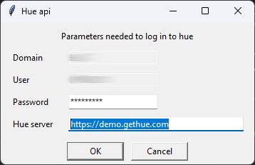

# HUE API
## Tool to interact with HUE website like if it were an API

### Introduction
This API has been generated through reverse engineering on the hue website.
It might not work in all cases or in old setups. 
You can try it in the [hue demo site](https://demo.gethue.com/), with user and password equal to `demo`.

Package to connect to a hue website and download queries like an API.

### Functionalities
* For SQL queries:
  * Download sql as csv or xlsx files
  * Read sql code as pandas dataframe
* For hdfs
  * List contents of any folder
  * Download any file from hdfs to local computer

### Prerequisites
At first execution, program will ask for the hue url and the current user password. Then it will be stored in the computer keyring


### Limitations
Hue web can only download up to 1.000.000 rows.

If downloading to CSV, chunk_size can be used to split a big query into smaller ones

### Use
#### Command line script
Call the `hue_api` script. For the queries to work, they must use ' instead of " internally for sql strings

Execute command line without arguments to get full help:
```commandline
hue_api 
```
Examples of use
```commandline
hue_api -s "select * from tabla1" -s "select * from tabla2 where tabla2.campo in ('valor1', 'valor2')"
```
Ejecuta las dos consultas y las guarda en los ficheros consulta1.csv y consulta2.csv de la carpeta actual
```commandline
hue_api -p="C:\\ejemplo de path" -s "select * from ejemplo"
```
Ejecuta la consulta y la guarda en el fichero consulta1.csv en la carpeta c:\\ejemplo de consulta
```commandline
hue_api -q -s "select * from ejemplo"
```
Ejecuta la consulta y la guarda en el fichero consulta1.csv de la carpeta actual sin enviar notificaciones
```commandline
hue_api -n "query de ejemplo" -s "select * from ejemplo"
```
Ejecuta la consulta y la guarda en el fichero query de ejemplo.csv de la carpeta actual
```commandline
hue_api -f xls -n "query de ejemplo" -s "select * from ejemplo"
```
Ejecuta la consulta y la guarda en el fichero query de ejemplo.xlsx de la carpeta actual
```commandline
hue_api -f xls -n "query de ejemplo" -s "select * from ejemplo" -s "select * from ejemplo2"
```
Falla: hay que indicar tantos -n como -s
```commandline
hue_api -s "/dir1/dir2/filename"
```
Descarga el fichero hdfs filename en la carpeta actual
```commandline
hue_api -s "/dir1/dir2/filename1" -s "/dir1/dir2/filename2 -p c:\\"    
```
Descarga los fichero hdfs filename1 y filename2 en la carpeta c:\\
```commandline
hue_api -s "select * from table1 where col1="${param}" -k param -v 12 -k param2 -v value2
```
Descarga la consulta sustituyendo el parámetro param por el valor 12. Param2 se ignora


#### Python code

```python
from ong_hue_api.hue import Hue

hue = Hue()
query = "put your SQL query here"
path = "directory where files will be created"
name = "file name (without extension)"
#################################
#   Examples of query execution
#################################
# Download query in CSV format (fastest)
hue.execute_query(query=query, path=path, name=name, format="csv")
# Download query in CSV format chunked in 100k rows.
# (This could be useful if query size is above 1.000.000 rows or query is too complex and causes timeouts)
hue.execute_query(query=query, path=path, name=name, format="csv", chunk_rows=100000)
# Download query as XLS (slower than CSV)
hue.execute_query(query=query, path=path, name=name, format="xls")
# Get result as pandas DataFrame (slowest, but useful for small queries <1000 rows)
df = hue.execute_query(query=query, format="pandas")
# Download query in CSV format with hue parameters
hue.execute_query(query="Select * from db.table where field1=${one} and field2=\"${two}\"", 
                  path=path, name=name, format="csv", variables=dict(one=1, two=2))

#################################
#   Examples of hdfs operations
#################################
# Gets in files a dict of filename:filepath for thefiles in /root
files = hue.filebrowser("/root")
# Gets in files a dict of filename:filepath for thefiles in /root, only if filename cointains "nice"
files = hue.filebrowser("/root", filter="nice")
# Downloads bigfile.pkl in current directory and returns filename
downloaded_file = hue.download_file("/root/bigfile.pkl")
# Downloads bigfile.pkl in current directory with the name not_so_big.pkl and returns filename
downloaded_file = hue.download_file("/root/bigfile.pkl", local_filename="not_so_big.pkl")
# Downloads bigfile.pkl in current directory with the name not_so_big.pkl in folder c:\ and returns filename
downloaded_file = hue.download_file("/root/bigfile.pkl", local_filename="not_so_big.pkl", path="C:\\")

##########################################################
#   Logout (not recommended as login process is too slow)
##########################################################
# Optional if you want to close session and not reuse it. Not needed and not recommened
# hue.logout()
```